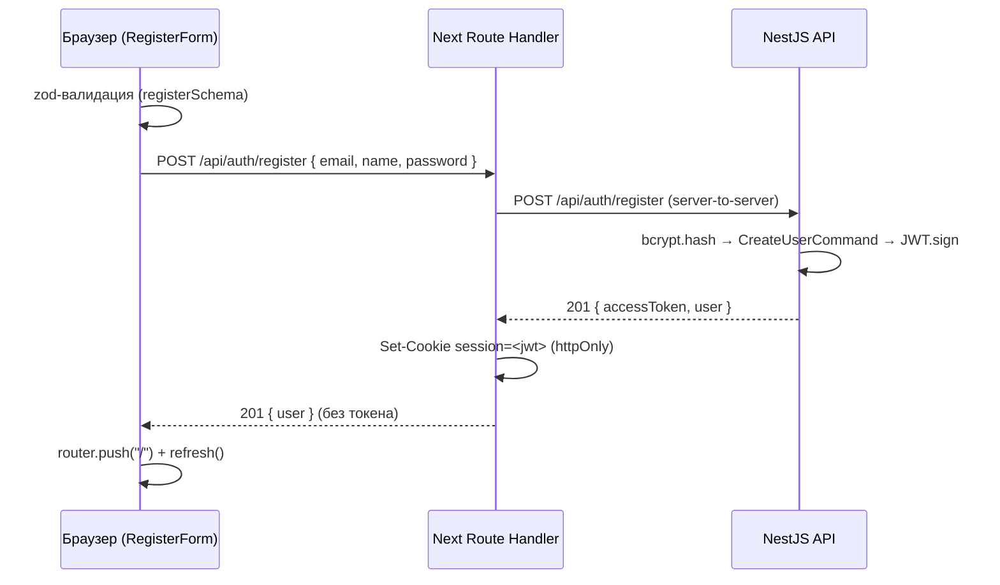
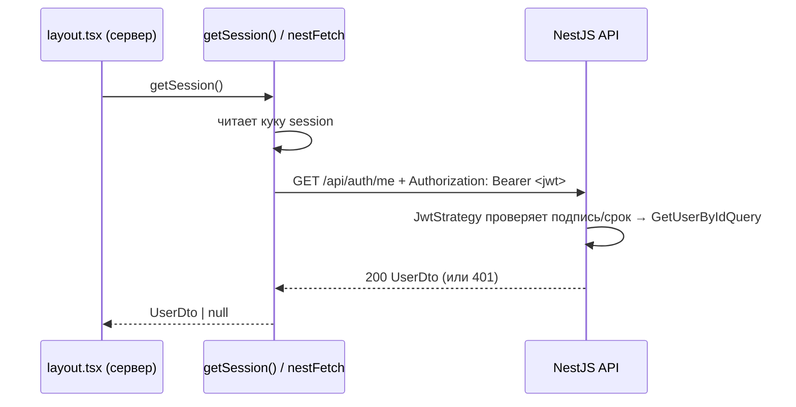

# Авторизация: как устроена, что на клиенте, что на сервере

Документ описывает полный поток аутентификации трекера расходов — от нажатия
«Войти» в браузере до проверки JWT в NestJS. Здесь два независимых приложения:

| Приложение | Что это                    | Порт    | Роль в авторизации                               |
| ---------- | -------------------------- | ------- | ------------------------------------------------ |
| `apps/web` | Next.js 16 (App Router)    | `:3000` | UI + **BFF**: формы, Route Handlers, кука сессии |
| `apps/api` | NestJS 11 (префикс `/api`) | `:3001` | выдача и проверка JWT, хранение пользователей    |

Ключевой принцип — **BFF (Backend-for-Frontend) с httpOnly-кукой**:

> Браузерный JavaScript **никогда не видит JWT**. Токен из ответа Nest перехватывает
> серверная часть Next и кладёт его в **httpOnly-куку** `session`. Наружу (в JS) отдаётся
> только объект пользователя. Поэтому XSS не может украсть токен, а клиентский код не
> занимается его хранением.

---

## Общая схема (кто с кем говорит)

```
Браузер (клиентский JS)
   │  fetch, same-origin, БЕЗ токена
   ▼
Next Route Handler  (apps/web/src/app/api/auth/*)      ← «сервер Next», BFF
   │  server-to-server, кладёт Bearer при /me
   ▼
NestJS API  (apps/api, /api/auth/*)                    ← выдаёт/проверяет JWT
   │
   ▼
PostgreSQL (через Prisma)
```

- **Браузер ↔ Next** — свой origin `http://localhost:3000`, тело JSON, токена в запросе нет,
  кука `session` ходит автоматически (httpOnly).
- **Next ↔ Nest** — server-to-server на `http://localhost:3001`. Именно здесь появляется
  заголовок `Authorization: Bearer <jwt>` (только для запросов, требующих пользователя).

Из-за BFF браузер напрямую в Nest не ходит, поэтому CORS в реальном потоке почти не
задействован (хотя настроен — см. ниже).

---

## Сервер (NestJS API) — `apps/api`

Модуль `auth` (`apps/api/src/auth/`) отвечает за выдачу и проверку токенов. С хранилищем
пользователей (`users`) он общается **только через CQRS-шину** (`CommandBus`/`QueryBus`),
не импортируя `UsersService` напрямую.

### Эндпоинты — `auth.controller.ts`

Контроллер `@Controller("auth")` + глобальный префикс `api` (`main.ts`) → реальные пути:

| Метод | Путь                 | Код успеха                 | Тело запроса                      | Guard          | Ответ             |
| ----- | -------------------- | -------------------------- | --------------------------------- | -------------- | ----------------- |
| POST  | `/api/auth/register` | **201**                    | `RegisterDto`                     | —              | `AuthResponseDto` |
| POST  | `/api/auth/login`    | **200** (`@HttpCode(200)`) | `LoginDto`                        | —              | `AuthResponseDto` |
| GET   | `/api/auth/me`       | 200                        | — (нужен `Authorization: Bearer`) | `JwtAuthGuard` | `UserDto`         |

Валидация тела — через `ZodValidationPipe` **на параметре** `@Body`, схемы `registerSchema` /
`loginSchema` берутся из `@repo/shared` (общие с фронтом). При ошибке — `400` с телом
`{ message: "Ошибка валидации", issues: [...], statusCode: 400 }`.

### Что делает `AuthService` — `auth.service.ts`

**`register(dto)`**

1. `bcrypt.hash(password, 10)` — хэширует пароль (10 раундов).
2. Диспатчит `CreateUserCommand(email, name, passwordHash)` через `CommandBus`.
   Сохранение делает `users`; уникальность email ловится в `CreateUserHandler` по коду
   Prisma **`P2002`** → `ConflictException("Email уже занят")` (**409**).
3. `buildResponse(user)` — подписывает JWT и возвращает `{ accessToken, user }`.

**`login(dto)`**

1. `GetUserByEmailQuery(email)` через `QueryBus`.
2. Если пользователя нет **или** `bcrypt.compare(password, passwordHash)` не сошёлся →
   `UnauthorizedException("Неверный email или пароль")` (**401**). Формулировка одна на оба
   случая — чтобы не подсказывать, существует ли email.
3. `buildResponse(user)`.

**`me(userId)`**

1. `GetUserByIdQuery(userId)` — **перепроверяет, что пользователь ещё существует** (мог быть
   удалён, пока жив 7-дневный токен). Нет → `UnauthorizedException` (**401**).
2. Возвращает `UserDto`.

**`buildResponse` / `toUserDto`**

```ts
private buildResponse(user: User): AuthResponseDto {
  const accessToken = this.jwt.sign({ sub: user.id, email: user.email });
  return { accessToken, user: this.toUserDto(user) };
}
private toUserDto(user: User): UserDto {
  return { id: user.id, email: user.email, name: user.name };
}
```

> `passwordHash` **никогда не покидает бэкенд** — наружу уходит только `{ id, email, name }`.

### Подпись и проверка JWT

- **Подпись** — `JwtModule` (`auth.module.ts`): секрет из `JWT_SECRET`, `expiresIn: "7d"`.
  Payload: `{ sub: user.id, email: user.email }`.
- **Проверка** — `JwtStrategy` (`jwt.strategy.ts`, passport-jwt):
  - токен извлекается из `Authorization: Bearer <token>` (`ExtractJwt.fromAuthHeaderAsBearerToken()`);
  - `ignoreExpiration: false` — просроченный токен отклоняется;
  - `validate(payload)` возвращает `{ userId: payload.sub, email }`, и Passport кладёт это в
    `request.user`.
  - **Без `JWT_SECRET` приложение не стартует** — стратегия бросает ошибку прямо при
    инициализации.
- **`JwtAuthGuard`** (`jwt-auth.guard.ts`) — тонкий `AuthGuard("jwt")`; вешается на защищённые
  эндпоинты (`@UseGuards(JwtAuthGuard)`).
- **`@CurrentUser()`** (`current-user.decorator.ts`) — достаёт `request.user.userId`, чтобы
  контроллер получал `userId` из токена, а не из query. Так держится изоляция пользователей.

### CORS и глобальный пайп — `main.ts`

```ts
app.enableCors({ origin: process.env.CORS_ORIGIN ?? "http://localhost:3000", credentials: true });
app.setGlobalPrefix("api");
app.useGlobalPipes(
  new ValidationPipe({ whitelist: true, forbidNonWhitelisted: true, transform: true }),
);
```

CORS разрешает origin фронта (на случай прямых запросов). Глобальный `ValidationPipe` нужен
модулям `categories` и `transactions` (class-validator) и **не мешает** zod-контроллерам auth.

---

## Клиент + BFF (Next.js) — `apps/web`

Организация — Feature-Sliced Design. За авторизацию отвечают слои `features/auth`,
`entities/session`, BFF-хендлеры в `app/api/auth`, а также `shared/api` и `shared/config`.

### 1. Формы (клиентские компоненты) — `features/auth/{login,register}`

- **UI**: `LoginForm.tsx` / `RegisterForm.tsx` (`"use client"`) на shadcn `Form`.
- **Модель**: `use-login.ts` / `use-register.ts` — `react-hook-form` + `zodResolver` с теми же
  `loginSchema` / `registerSchema` из `@repo/shared`, что и на бэке. То есть базовая валидация
  (email; `name` 1..120; `password` 8..72 при регистрации / непустой при входе) проходит **на
  клиенте до отправки**.
- `onSubmit` шлёт `fetch` на **свой же** Route Handler (same-origin), **без токена**:
  ```ts
  await fetch("/api/auth/login", {
    method: "POST",
    headers: { "Content-Type": "application/json" },
    body: JSON.stringify(values),
  });
  ```
- **Маппинг серверных ошибок** обратно в форму:
  - register **409** → ошибка под полем `email` («Email уже занят»);
  - **400** с `issues` → ошибки по соответствующим полям;
  - всё прочее, в т.ч. login **401**, → корневая ошибка формы (`setError("root", …)`).
- При успехе → `router.push("/")` + `router.refresh()` (перечитать серверную сессию).

### 2. BFF Route Handlers — `app/api/auth/{login,register,logout}/route.ts`

Тонкие `POST`-обёртки. Login и register делегируют в общий `proxyAuth`
(`shared/api/auth.server.ts`, `server-only`):

```ts
export async function proxyAuth(path, body) {
  const response = await nestFetch(path, { method: "POST", body: JSON.stringify(body) });
  const data = await response.json().catch(() => ({}));

  if (!response.ok) {
    return NextResponse.json(data, { status: response.status }); // пробрасываем 401/409/400 как есть
  }

  const { accessToken, user } = data; // токен остаётся на сервере
  (await cookies()).set(SESSION_COOKIE, accessToken, sessionCookieOptions());
  return NextResponse.json({ user }); // наружу — только user
}
```

- **Успех** → `accessToken` кладётся в httpOnly-куку `session`, клиенту возвращается `{ user }`.
- **Ошибка** → статус и тело Nest (`message`, `issues`) пробрасываются клиенту без токена.
- **`logout`** → `cookies().delete(SESSION_COOKIE)`.

**Опции куки** — `shared/config/cookie.ts`:

```ts
export const SESSION_COOKIE = "session";
// httpOnly, sameSite "lax", secure только в проде, path "/", maxAge = 7 дней (под срок JWT)
```

**Низкоуровневый клиент к Nest** — `shared/api/nest.ts` (`server-only`):
`nestFetch(path, { token })` бьёт в `${NEXT_PUBLIC_API_URL}/api${path}`, ставит
`Authorization: Bearer` при наличии токена, `cache: "no-store"`; `nestJson<T>()` — обёртка,
которая бросает исключение на не-2xx.

### 3. Чтение сессии на сервере — `entities/session`

- **`model/session.server.ts`** (`server-only`) — `getSession()`:
  ```ts
  const token = (await cookies()).get(SESSION_COOKIE)?.value;
  if (!token) return null;
  try {
    return await nestJson<UserDto>("/auth/me", { token });
  } catch {
    return null;
  }
  ```
  То есть кука не просто читается — токен **валидируется реальным запросом к Nest `/auth/me`**
  (истёк/пользователь удалён → `null`).
- **`model/session-context.tsx`** (`"use client"`) — `SessionProvider` + хук `useSession()`.
- Публичные входы **разделены**: клиентский `index.ts` экспортирует `SessionProvider`/`useSession`,
  серверный `server.ts` — `getSession`. Так `server-only`-модуль не попадает в клиентский бандл.

### 4. Провайдер и layout — `app/layout.tsx`

Корневой layout серверный и async:

```tsx
const user = await getSession();
return (
  <html lang="ru">
    <body>
      <SessionProvider user={user}>{children}</SessionProvider>
    </body>
  </html>
);
```

Начальное значение сессии приходит **с сервера**, поэтому `useSession()` на клиенте имеет
правильное значение уже на первом рендере (без «мигания»).

### 5. Виджет статуса и выход — `widgets/auth-status`, `features/auth/logout`

`AuthStatus` через `useSession()` показывает либо ссылки «Войти»/«Регистрация» (гость), либо
«Вы вошли как …» + `LogoutButton`. Кнопка выхода делает `POST /api/auth/logout` и
`router.refresh()`.

### 6. Редирект на страницах входа — `apps/web/src/proxy.ts`

Конвенция Next 16 `proxy` (бывш. `middleware`). Если кука `session` присутствует, залогиненного
уводит с `/login` и `/register` на `/` (matcher только на эти пути). Это лёгкая проверка
**наличия** куки; полная валидация токена — в `getSession()` серверных компонентов.

---

## Потоки целиком

### Регистрация



Если email занят: Nest → `409 "Email уже занят"`, Next пробрасывает `409`, форма показывает
ошибку под полем email.

### Вход

Аналогично регистрации, но `POST /api/auth/login` → Nest сверяет `bcrypt.compare`. Успех
(**200**) → кука + `{ user }`. Неверные данные → `401 "Неверный email или пароль"` →
корневая ошибка формы.

### Запрос, требующий пользователя (`/me` при чтении сессии)



### Выход

`POST /api/auth/logout` → `cookies().delete("session")` → `router.refresh()` → `getSession()`
возвращает `null` → UI показывает гостевое состояние.

---

## Примеры запросов и ответов (curl)

> В PowerShell используйте `curl.exe` (а не алиас `curl`) и экранируйте кавычки, либо
> вызывайте из Git Bash. Тела и токены ниже — иллюстративные.

### Через BFF (порт 3000) — как ходит браузер

Именно так работает реальный фронт: same-origin, тело JSON, **токен в ответе не приходит** —
он оседает в httpOnly-куке. `-c/-b cookies.txt` сохраняет и переиспользует куку.

```bash
# Регистрация: заводим куку session, наружу — только user
curl -i -c cookies.txt -X POST http://localhost:3000/api/auth/register \
  -H "Content-Type: application/json" \
  -d '{"email":"ivan@example.com","name":"Иван","password":"secret123"}'
# HTTP/1.1 201 Created
# set-cookie: session=eyJhbGciOi...; Path=/; HttpOnly; SameSite=Lax; Max-Age=604800
# {"user":{"id":"7b1e...","email":"ivan@example.com","name":"Иван"}}

# Вход: тоже ставит куку, отдаёт { user }
curl -i -c cookies.txt -X POST http://localhost:3000/api/auth/login \
  -H "Content-Type: application/json" \
  -d '{"email":"ivan@example.com","password":"secret123"}'
# HTTP/1.1 200 OK
# set-cookie: session=eyJhbGciOi...; Path=/; HttpOnly; SameSite=Lax; Max-Age=604800
# {"user":{"id":"7b1e...","email":"ivan@example.com","name":"Иван"}}

# Выход: снимает куку
curl -i -b cookies.txt -X POST http://localhost:3000/api/auth/logout
# HTTP/1.1 200 OK
# set-cookie: session=; Path=/; Max-Age=0
# {"ok":true}
```

> На стороне Next **нет** эндпоинта `/api/auth/me`: текущий пользователь читается серверными
> компонентами через `getSession()` (который сам ходит в Nest `/me` с токеном из куки), а не
> отдельным клиентским запросом.

Ошибки BFF пробрасывает как есть:

```bash
# Повторная регистрация того же email
curl -s -X POST http://localhost:3000/api/auth/register \
  -H "Content-Type: application/json" \
  -d '{"email":"ivan@example.com","name":"Иван","password":"secret123"}'
# 409 {"message":"Email уже занят","error":"Conflict","statusCode":409}

# Неверный пароль на входе
curl -s -X POST http://localhost:3000/api/auth/login \
  -H "Content-Type: application/json" \
  -d '{"email":"ivan@example.com","password":"wrong"}'
# 401 {"message":"Неверный email или пароль","error":"Unauthorized","statusCode":401}
```

### Напрямую в Nest (порт 3001) — для отладки API

Здесь токен **виден в теле** (`accessToken`), и его нужно вручную передавать в `Authorization`.
Так фронт в бою не делает — это только для проверки самого API.

```bash
# Регистрация
curl -s -X POST http://localhost:3001/api/auth/register \
  -H "Content-Type: application/json" \
  -d '{"email":"ivan@example.com","name":"Иван","password":"secret123"}'
# 201 {"accessToken":"eyJhbGciOi...","user":{"id":"7b1e...","email":"ivan@example.com","name":"Иван"}}

# Вход
curl -s -X POST http://localhost:3001/api/auth/login \
  -H "Content-Type: application/json" \
  -d '{"email":"ivan@example.com","password":"secret123"}'
# 200 {"accessToken":"eyJhbGciOi...","user":{...}}

# Текущий пользователь по токену
curl -s http://localhost:3001/api/auth/me \
  -H "Authorization: Bearer eyJhbGciOi..."
# 200 {"id":"7b1e...","email":"ivan@example.com","name":"Иван"}

# Без/с битым токеном
curl -s http://localhost:3001/api/auth/me
# 401 {"message":"Unauthorized","statusCode":401}

# Ошибка валидации (пароль короче 8 символов)
curl -s -X POST http://localhost:3001/api/auth/register \
  -H "Content-Type: application/json" \
  -d '{"email":"a@b.com","name":"A","password":"123"}'
# 400 {"message":"Ошибка валидации","issues":[{"code":"too_small","path":["password"],...}],"statusCode":400}
```

---

## Обработка ошибок (сводка)

| Ситуация                                | Nest отдаёт                                    | Что делает форма                                               |
| --------------------------------------- | ---------------------------------------------- | -------------------------------------------------------------- |
| Невалидное тело                         | `400 { message, issues }`                      | ошибки по полям из `issues` (обычно отсекается клиентским zod) |
| Email занят (register)                  | `409 { message: "Email уже занят" }`           | ошибка под полем `email`                                       |
| Неверные креды (login)                  | `401 { message: "Неверный email или пароль" }` | корневая ошибка формы                                          |
| Токен истёк/пользователь удалён (`/me`) | `401`                                          | `getSession()` → `null`, UI как для гостя                      |

---

## Безопасность — что и почему

- **JWT в httpOnly-куке** — недоступен из JS, XSS не украдёт токен; клиент не хранит его сам.
- **`sameSite: "lax"`** — базовая защита от CSRF; логин/логаут — POST.
- **`secure` только в проде** — по HTTPS в проде, но не мешает локальной разработке по HTTP.
- **`passwordHash` не покидает бэкенд** — наружу только `{ id, email, name }`.
- **`JWT_SECRET` обязателен** — без него API не стартует (проверка в `JwtStrategy`).
- **`/me` перепроверяет существование пользователя** — удалённый юзер с валидным токеном
  получает `401`.
- **Пароль ≤ 72 символа** (`registerSchema`) — предел bcrypt: байты сверх 72 молча обрезаются.
- **`userId` — из токена, а не из query** (`@CurrentUser()`) — пользователь не может читать
  чужие данные, подставив чужой id.

---

## Ограничения текущей реализации

- **Один access-токен, без refresh-токена.** Живёт 7 дней (совпадает с `maxAge` куки). По
  истечении `/me` вернёт `401`, и пользователь окажется «разлогинен» — тихого обновления нет.
- **Приватные маршруты пока не защищены** глобально: `proxy.ts` лишь уводит залогиненного со
  страниц входа. Защита будущих приватных страниц — отдельная задача.
- **Фронтенд транзакций ещё не сделан.** API-модуль `transactions` (`/api/transactions` +
  `/summary`, Bearer из токена) готов и покрыт тестами; страница и фичи FSD под него —
  отдельная задача.

---

## Карта файлов

**Сервер (`apps/api/src/`)**

| Файл                                    | Назначение                                        |
| --------------------------------------- | ------------------------------------------------- |
| `auth/auth.controller.ts`               | эндпоинты register/login/me                       |
| `auth/auth.service.ts`                  | bcrypt, подпись JWT, сборка ответа                |
| `auth/auth.module.ts`                   | `JwtModule` (секрет, `expiresIn: 7d`), провайдеры |
| `auth/jwt.strategy.ts`                  | проверка токена, `request.user`                   |
| `auth/jwt-auth.guard.ts`                | `AuthGuard("jwt")`                                |
| `auth/current-user.decorator.ts`        | `@CurrentUser()` → `userId` из токена             |
| `users/handlers/create-user.handler.ts` | создание юзера, `P2002` → 409                     |
| `main.ts`                               | CORS, префикс `/api`, глобальный `ValidationPipe` |

**Клиент/BFF (`apps/web/src/`)**

| Файл                                                | Назначение                                            |
| --------------------------------------------------- | ----------------------------------------------------- |
| `features/auth/login/*`, `features/auth/register/*` | формы + модель (RHF + zodResolver)                    |
| `features/auth/logout/ui/LogoutButton.tsx`          | выход                                                 |
| `app/api/auth/{login,register,logout}/route.ts`     | BFF Route Handlers                                    |
| `shared/api/auth.server.ts`                         | `proxyAuth` (прокси + установка куки)                 |
| `shared/api/nest.ts`                                | `nestFetch` / `nestJson` (клиент к Nest, server-only) |
| `shared/config/cookie.ts`                           | имя и опции куки `session`                            |
| `entities/session/model/session.server.ts`          | `getSession()` (server-only)                          |
| `entities/session/model/session-context.tsx`        | `SessionProvider` / `useSession()`                    |
| `app/layout.tsx`                                    | читает сессию, оборачивает в провайдер                |
| `widgets/auth-status/*`                             | статус входа на главной                               |
| `proxy.ts`                                          | редирект залогиненного с `/login`,`/register`         |

**Общее (`packages/shared/src/index.ts`)** — `registerSchema`, `loginSchema`, типы
`RegisterDto`, `LoginDto`, `UserDto`, `AuthResponseDto`. Одни и те же правила валидации и
формы ответа используют обе стороны.
